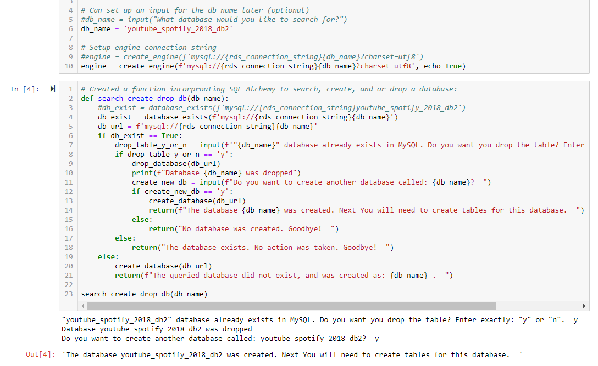

# Spotify 2018 Top 100 Artists - How Many Top Trending YouTube Videos Did They Have?

## Scope

* For this project, I wanted to further develop my ETL skills, so that was where my main focus was. I extracted, transformed, and loaded up both Spotify's 2018 Top 100 Songs and YouTube's 2018 Top Trending Videos (videos categorized as music only), and created an "Artist" column to enable joining with Spotify's Top 100 Songs of 2018. The YoutTube data came in two parts, a csv and json format, and the Spotify data was also in a csv format. All three (YouTube statistical and core information, categories, and Spotify's Top 100 Songs) parts were loaded into MySQL as three seperate tables where I later joined all of them to come to my results.

## PURPOSE:
* Music is one of my loves in life, next to my family, close friends, and food. I listen to everything ranging from Hip Hop / Rap, RNB, Electronic Dance Music, Pop, Classics, 70's, 80's, 90's music. I thought it would be really fun and a great experience to work with data that I am very familiar with.

## System Prerequisites
You will need the following installed on your computer system, if you want to replicate my analysis:
* Python >= 3.7 and the associated libraries:
  * os
  * sys
  * csv
  * json
  * simplejson
  * numpy
  * pandas
  * datetime
  * string
  * sqlalchemy
  * pymysql
* Jupyter Notebook - all of the programming reside in these files

## Data Source:
I acquired both of my datasets from Kaggle from the links below:
- https://www.kaggle.com/datasnaek/youtube-new (this is an updated link, whereas I used an older version of this file, which is attached in the resources)
- https://www.kaggle.com/nadintamer/top-spotify-tracks-of-2018

## Getting Started

* Viewing Source Code - if this is the route you'd like to go, then please click on the Jupyter Notebooks in the repository that I've numbered numerically as you can easily view these files via Github. All of the action is here!
* Clone / Download Entire Repository - if you'd like to replicate my work, please download / clone my repository and install all of the prerequisites. After, you can open the Jupyter Notebooks to see all of the raw calcuations and code.

## Sample Code And Findings:

* Here I created a function using Python and SQL Alchemy to scan my MySQL database (db) for a database called 'youtube_spotify_2018_db2'(this can easily be later changed to an input function where you can input a potential name to identify a database by). If it existed, it would ask you if you wanted to drop the db, or it would inform you no action was taken. If you said 'y', then it would drop the database and ask you if you want to recreate a db with the same name. This was to ensure that I was starting with fresh data everytime I reran the code, as I was testing throughout my project. In a realistic setting, I would tailor it for the end-user's preferred use case.

* I wanted to emphasize this nested loop I created below because it was the main key that would unlock treasure chest, where the answer to this project would lie. I created an "Artist" column on the final YouTube Tables joined via Pandas in a dataframe format. I then created this nested loop that would enabled me identify which how many, and which Trending YouTube video belonged to which Spotify Artist. I accomplished this by targeting the artist names (referred to as channel title on YouTube), made them both uniform by removing all spaces, making them lowercase, and had the loop fill in the empty "artist" column if there was a match. This Big O notation for time complexity would be an (n*m) function, as it was a nested loop on two seperate arrays. This was substantiated by the signifcant more amount of time I had to wait for this to run, but it was necessary.

* Here are the results we can see all of the artists that were listed on Spotify's Top 100 Songs for 2018, and the respective number of top trending videos they had in 2018.

### Hope you enjoyed it. Thank you for your time!

## Author

* **Johneson Giang** - *Invidual Project* - [Github](https://github.com/jhustles)

## License

This project is licensed under the MIT License - see the [LICENSE.md](LICENSE.md) file for details

## Acknowledgments
* I definitely want to give a shout out to my dear teacher, mentor, and friend @CodingWithCorgis!
