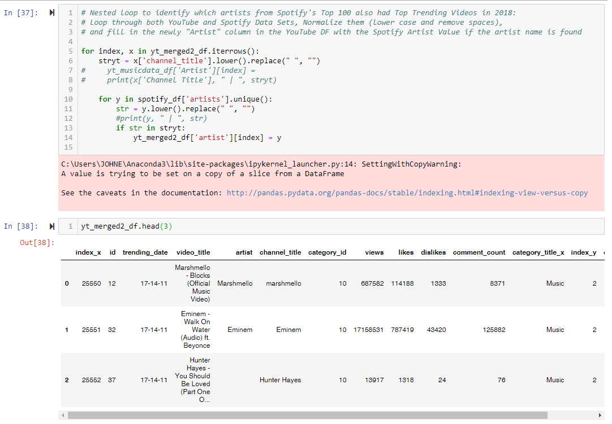
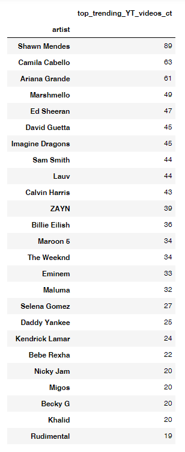

## Project Scope

* Extracted, transformed, and loaded up YouTube's Top Trending Videos from December 2017 thru May 2018 for their videos categorized as music only, and created an "Artist" column to enable joining with Spotify's Top 100 Songs of 2018. Both dataframes were loaded into MySQL.

## PURPOSE:
* Music is one of my loves in life, next to my family, close friends, and food. I listen to everything ranging from Hip Hop / Rap, RNB, Electronic Dance Music, Pop, Classics, 70's, 80's, 90's music. I thought it would be really fun and a great experience for me for me to work with data that I am very familiar with.

## System Prerequisites
You will need the following installed on your computer system, if you want to replicate my analysis:
* Python >= 3.7 and the associated libraries:
  * os
  * sys
  * csv
  * json
  * simplejson
  * numpy
  * pandas
  * datetime
  * string
  * sqlalchemy
  * pymysql
* Jupyter Notebook - all of the programming reside in these files

## Getting Started

* Viewing Source Code - if this is the route you'd like to go, then please click on the Jupyter Notebooks in the repository that I've numbered numerically as you can easily view these files via Github. All of the action is here!
* Clone / Download Entire Repository - if you'd like to replicate my work, please download / clone my repository and install all of the prerequisites. After, you can open the Jupyter Notebooks to see all of the raw calcuations and code.

## Key Findings And Outputs

## Author

* **Johneson Giang** - *Invidual Project* - [Github](https://github.com/jhustles)

## License

This project is licensed under the MIT License - see the [LICENSE.md](LICENSE.md) file for details

## Acknowledgments
* I definitely want to give a shout out to my dear teacher, mentor, and friend @CodingWithCorgis!
